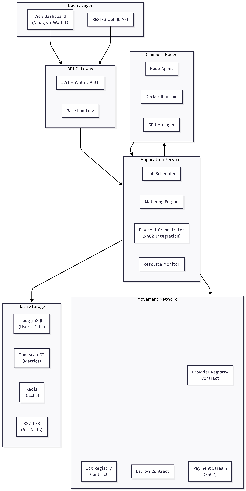

# ComputeStream

**Decentralized GPU Marketplace with x402 Micropayment Streaming on Movement Network**

A peer-to-peer compute marketplace enabling sub-cent, per-second GPU rental through x402 payment streaming.

---

## System Architecture



---

## Core Components

### 1. Smart Contracts (Movement L1)
- **ProviderRegistry**: Register providers, manage availability, pricing
- **JobRegistry**: Create jobs, track status, store job data
- **Escrow**: Lock funds, release payments, handle refunds
- **PaymentStream (x402)**: Per-second micropayment streaming

### 2. Backend API (Node.js/Express)
- Provider management endpoints
- Job lifecycle management
- x402 payment stream orchestration
- Mock compute execution service

### 3. Frontend Dashboard (Next.js)
- Provider registration & management
- Browse available providers
- Create & monitor jobs
- Real-time payment stream visualization

### 4. Data Layer
- **PostgreSQL**: Providers, jobs, transactions
- **TimescaleDB**: Per-second metrics & payments
- **Redis**: Active job state, caching

---

## Key Workflows

### Provider Onboarding
1. Register provider on-chain (GPU specs, price/second)
2. Stake tokens for reputation
3. Start heartbeat reporting
4. Appear in marketplace

### Job Execution
1. Buyer selects provider & creates job
2. Deposit escrow to smart contract
3. Job dispatched to provider
4. x402 payment stream opens (per-second payments)
5. Provider executes job (Docker container)
6. Job completes → final settlement
7. Output artifacts stored (S3/IPFS)

### Payment Streaming (x402)
- Escrow locked in contract
- Every second: release `price_per_second` to provider
- Real-time tracking in TimescaleDB
- Early termination → auto-refund remaining escrow

---

## Tech Stack

| Layer | Technology |
|-------|-----------|
| **Frontend** | Next.js 14, TailwindCSS, Movement wallet adapter |
| **Backend** | Node.js, Express, REST API |
| **Blockchain** | Movement Network, x402 SDK |
| **Database** | PostgreSQL, TimescaleDB, Redis |
| **Storage** | S3, IPFS |
| **Infrastructure** | Docker, Kubernetes |

---

## API Endpoints

**Providers**
- `POST /api/v1/providers/register` - Register provider
- `GET /api/v1/providers/available` - List available providers
- `PATCH /api/v1/providers/:id/availability` - Update availability

**Jobs**
- `POST /api/v1/jobs/create` - Create job
- `GET /api/v1/jobs/:id/status` - Get job status
- `GET /api/v1/jobs/history` - List jobs

**Payments**
- `POST /api/v1/escrow/deposit` - Deposit escrow
- `GET /api/v1/payments/stream/:jobId` - Get payment stream data

---

## Data Models

### Provider
```typescript
{
  id: string
  walletAddress: string
  gpuType: string
  vramGB: number
  pricePerSecond: number
  reputationScore: number
  isActive: boolean
}
```

### Job
```typescript
{
  jobId: string
  buyerAddress: string
  providerAddress: string
  dockerImage: string
  status: 'pending' | 'running' | 'completed' | 'failed'
  escrowAmount: number
  maxDuration: number
  startTime: Date
  endTime: Date
  outputUrl: string
}
```

---

## Smart Contract Functions

### ProviderRegistry
- `registerProvider(gpuType, vramGB, pricePerSecond, stakeAmount)`
- `updateAvailability(isActive)`
- `getProviders()` → Provider[]

### JobRegistry
- `createJob(providerId, dockerImage, maxDuration, escrowAmount)` → jobId
- `updateJobStatus(jobId, status)`
- `getJob(jobId)` → Job

### Escrow
- `depositEscrow(jobId, amount)`
- `releasePayment(jobId, amount, recipient)`
- `refundEscrow(jobId)`

### PaymentStream (x402)
- `openStream(jobId, provider, ratePerSecond)`
- `processPayment(jobId)` - Called every second
- `closeStream(jobId)`

---

## Security

- **Provider Verification**: Signed attestations every second
- **Sandboxing**: Docker containers with resource limits
- **Payment Security**: x402 protocol with on-chain settlement
- **Dispute Resolution**: Cryptographic proofs + automated verification

---

## Quick Start (For Developers)

1. **Setup Environment**
   ```bash
   npm install
   cp .env.example .env
   # Configure Movement Network RPC, private keys, database URLs
   ```

2. **Deploy Contracts**
   ```bash
   cd contracts
   npm install
   npm run deploy
   # Save contract addresses to .env
   ```

3. **Setup Database**
   ```bash
   cd backend
   npm run migrate
   ```

4. **Start Services**
   ```bash
   npm run dev:backend  # Backend API
   npm run dev:frontend # Frontend dashboard
   ```

---

## Development Focus Areas

1. **Smart Contracts**: Deploy to Movement testnet, integrate x402
2. **Backend**: API endpoints, x402 SDK integration, mock compute service
3. **Frontend**: Wallet connection, provider/job management, real-time updates
4. **Integration**: End-to-end flow testing, payment stream verification

---

**Note**: This is a hackathon MVP. Focus on core functionality: provider registration, job creation, x402 payment streaming, and basic UI. Ship fast, iterate later.
